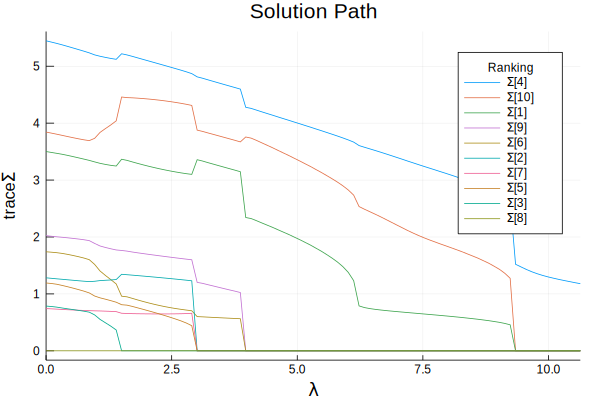

# Multivariate response model 

Machine information 


```julia
versioninfo()
```

    Julia Version 1.4.1
    Commit 381693d3df* (2020-04-14 17:20 UTC)
    Platform Info:
      OS: macOS (x86_64-apple-darwin18.7.0)
      CPU: Intel(R) Core(TM) i5-6267U CPU @ 2.90GHz
      WORD_SIZE: 64
      LIBM: libopenlibm
      LLVM: libLLVM-8.0.1 (ORCJIT, skylake)


## Demo data

For demonstration, we generate a random data set. We use the following distribution to generate response $Y$ of size $100 \times 3$:

$$Y \sim \text{Normal}(X\beta, \Sigma_1 \otimes V_1 + \cdots + \Sigma_{10}\otimes V_{10} + \Sigma_0 \otimes I_n)$$

where $\otimes$ indicates Kronecker product and each $\Sigma_i$ indicates variance component for $i$-th group, $i=0,1,\ldots, 10.$ We set  

$$\Sigma_i = \begin{cases} 1.5 \mathbf{I}_{100} & \text{ if } i=1,4,10 \\
                            \mathbf{I}_{100} & \text{ if } i=0 \\ 
                                \mathbf{0}& \text{ else. } \end{cases}$$

Define $\Omega = \text{Var}(Y) = \Sigma_1 \otimes V_1 + \cdots + \Sigma_{10} \otimes V_{10} + \Sigma_0\otimes I_n.$ The covariate matrix $X$ is generated using standard normal distribution. 


```julia
using LinearAlgebra, Random

## generate data from a d-variate response variance component model
Random.seed!(123)
n = 100          # no. observations
d = 3            # no. categories
m = 11           # no. variance components
p = 4            # no. covariates
X = randn(n, p)  # n-by-p covariate matrix 
β = ones(p, d)   # p-by-d mean component regression coefficient 

# a vector of d-by-d variance component parameters 
Σ = [zeros(d, d) for i in 1:m]
for i in [1, 4, 10]
  Σ[i] = 1.5 * Matrix{Float64}(I, d, d)
end
Σ[end] = Matrix{Float64}(I, d, d)

# a vector of covariance matrices 
V  = Array{Matrix{Float64}}(undef, m)
for i = 1:(m - 1)
  Zi = randn(n, 50)
  V[i] =  Zi * Zi'
  V[i] ./= norm(V[i])
end
V[end] = Matrix(I, n, n) ./ √n

# form overall nd-by-nd covariance matrix Ω
Ω = zeros(n*d, n*d)
for i = 1:m
    Ω .+= kron(Σ[i], V[i])
end
Ωchol = cholesky!(Symmetric(Ω))

# n-by-d responses
Y = X * β + reshape(Ωchol.L * randn(n*d), n, d);
```

True variance component parameter vector:


```julia
Σ
```


    11-element Array{Array{Float64,2},1}:
     [1.5 0.0 0.0; 0.0 1.5 0.0; 0.0 0.0 1.5]
     [0.0 0.0 0.0; 0.0 0.0 0.0; 0.0 0.0 0.0]
     [0.0 0.0 0.0; 0.0 0.0 0.0; 0.0 0.0 0.0]
     [1.5 0.0 0.0; 0.0 1.5 0.0; 0.0 0.0 1.5]
     [0.0 0.0 0.0; 0.0 0.0 0.0; 0.0 0.0 0.0]
     [0.0 0.0 0.0; 0.0 0.0 0.0; 0.0 0.0 0.0]
     [0.0 0.0 0.0; 0.0 0.0 0.0; 0.0 0.0 0.0]
     [0.0 0.0 0.0; 0.0 0.0 0.0; 0.0 0.0 0.0]
     [0.0 0.0 0.0; 0.0 0.0 0.0; 0.0 0.0 0.0]
     [1.5 0.0 0.0; 0.0 1.5 0.0; 0.0 0.0 1.5]
     [1.0 0.0 0.0; 0.0 1.0 0.0; 0.0 0.0 1.0]


## Goal

Suppose we wish to select $\Sigma_i$ that are associated with response $Y$ (among $i=1,\ldots, 10$). This can be achieved by `VCSEL.jl` package. 

!!! note
    
    Note that we do not select $\Sigma_0$. We consider this to be the intercept variance component. 

## Variance component selection

First load the package.


```julia
using VCSEL
```

To perform selection, take 2 steps:

**Step 1 (Construct a model)**. Construct an instance of `VCModel`, which is the fundamental type for variance component model. It includes fields 

* `Y`: $n$-by-$d$ responses. 
* `X`: $n$-by-$p$ covariate matrix (if exists).
* `V=[V[1],...,V[m],I]`: a vector of $n$-by-$n$ covariance matrices. The last covariance matrix must be positive definite and usually is a diagonal matrix. **All `V[i]` should have frobenius norm 1.**
* `Σ=[Σ[1],...,Σ[m],Σ[0]]`: a vector of initial estimates for $d$-by-$d$ variance component parameters. When $d=1$, `Σ` is a $m+1$-by-$1$ vector of scalars. If not supplied, it is set to be a vector of $d$-by-$d$ identity matrix by default (or vector of 1's if $d=1$). 

!!! note 

    All `V[i]` should have frobenius norm 1. This is easily achievable by `V[i] = V[i] / norm(V[i])`.

`VCModel` can be initialized by 

```julia
VCModel(Y, V)
VCModel(Y, V, Σ)
VCModel(Y, X, V)
VCModel(Y, X, V, Σ)
```

Let us construct a `VCModel` using `Y`, `X`, and `V`. Since we do not provide `Σ`, it is initialized to be a vector of identity matrices. 


```julia
vcm = VCModel(Y, X, V);
```

Note that every element of initial estimates for `Σ` is an identity matrix. 


```julia
vcm.Σ
```


    11-element Array{Array{Float64,2},1}:
     [1.0 0.0 0.0; 0.0 1.0 0.0; 0.0 0.0 1.0]
     [1.0 0.0 0.0; 0.0 1.0 0.0; 0.0 0.0 1.0]
     [1.0 0.0 0.0; 0.0 1.0 0.0; 0.0 0.0 1.0]
     [1.0 0.0 0.0; 0.0 1.0 0.0; 0.0 0.0 1.0]
     [1.0 0.0 0.0; 0.0 1.0 0.0; 0.0 0.0 1.0]
     [1.0 0.0 0.0; 0.0 1.0 0.0; 0.0 0.0 1.0]
     [1.0 0.0 0.0; 0.0 1.0 0.0; 0.0 0.0 1.0]
     [1.0 0.0 0.0; 0.0 1.0 0.0; 0.0 0.0 1.0]
     [1.0 0.0 0.0; 0.0 1.0 0.0; 0.0 0.0 1.0]
     [1.0 0.0 0.0; 0.0 1.0 0.0; 0.0 0.0 1.0]
     [1.0 0.0 0.0; 0.0 1.0 0.0; 0.0 0.0 1.0]


**Step 2 (Optimize)**. Call optimization routine `vcselect!`. 

Required input argument for executing `vcselect!` is:
    
- `VCModel`.

Keyword Arguments are 

- `penfun`: penalty function. Default is `NoPenalty()`. Other options are `L1Penalty()` and `MCPPenalty()`.
- `λ`: tuning parameter. Default is 1.0.    
- `penwt`: penalty weights. Default is (1,...1,0).
- `standardize`: logical flag for covariance matrix standardization. Default is `false`.
    If true, `V[i]` is standardized by its Frobenius norm, and parameter estimates are 
    returned on the original scale.
- `maxiters`: maximum number of iterations. Default is 1000.
- `tol`: convergence tolerance. Default is `1e-5`.
- `verbose`: display switch. Default is false.
- `checktype`: check argument type switch. Default is true.

<a id='no-penalty'></a>
### No penalty 

First, we call `vcselect!` without specifying any penalty function. By default, it is fit with no penalty (i.e. $\lambda=0$).


```julia
vcm_nopen = deepcopy(vcm);
vcm_nopen, final_obj, niters, = vcselect!(vcm_nopen);
## equivalent to 
# vcselect!(vcm_nopen; penfun=NoPenalty());
# vcselect!(vcm_nopen; λ=0.0)
```


    (VCModel{Float64}([1.860094835353257 2.055403434516128 2.84544587051332; 3.4359556067573895 2.8421454064488842 2.860512418851407; … ; -0.21488508947517132 -0.3336880873733919 0.3849750333444425; -2.7580470886596755 -3.400050457633945 -4.784333938275772], [1.1902678809862768 0.3762642112434747 0.34658945360812454 0.45809880324835406; 2.04817970778924 -0.4052717901213415 1.604313725337457 0.13912437753868148; … ; -0.16371133936712523 0.5752786905523419 -0.17655459673142 -0.045725895200926625; -0.9029858060964956 -0.16600120902535137 -1.2792370363858774 -1.3123821810547711], [[0.092494023125743 0.0030042568249118926 … -0.00922398515864249 0.013285729616217755; 0.0030042568249118926 0.04025705934773749 … 0.003708804177337504 0.003823593679063355; … ; -0.00922398515864249 0.003708804177337504 … 0.039439277698925315 0.001178066910649526; 0.013285729616217755 0.003823593679063355 … 0.001178066910649526 0.06886830969476362], [0.06030328209283304 -0.001024446424453263 … 0.002416656153804365 0.0063790347402901595; -0.001024446424453263 0.05853661106826809 … 0.0006337090856672788 0.007760397505232091; … ; 0.002416656153804365 0.0006337090856672788 … 0.07562956244880668 0.00030815255053525065; 0.0063790347402901595 0.007760397505232091 … 0.00030815255053525065 0.05701901985157344], [0.06322716304318081 -0.008711612549915216 … -0.0015279035339411636 0.022149776654320365; -0.008711612549915216 0.08061523894061923 … 0.009591847741341792 -0.003071120098660378; … ; -0.0015279035339411636 0.009591847741341792 … 0.05416995491912846 -0.0029020331844479843; 0.022149776654320365 -0.003071120098660378 … -0.0029020331844479843 0.05313609004607579], [0.06813121548362011 -0.0070291449197405756 … -0.0026551965249274802 -0.01674818135585094; -0.0070291449197405756 0.054198100753390724 … -0.0028780223522959485 0.0020700994740670414; … ; -0.0026551965249274802 -0.0028780223522959485 … 0.09097697256212886 -0.006540345065276699; -0.01674818135585094 0.0020700994740670414 … -0.006540345065276699 0.06960664355867946], [0.04668688768952539 0.0019236985688410111 … -0.0022665544476031733 -0.010434298910784219; 0.0019236985688410111 0.03392562063763582 … -0.0011424991420148395 -0.0046479249957258875; … ; -0.0022665544476031733 -0.0011424991420148395 … 0.05138535402954277 -0.008839324382598431; -0.010434298910784219 -0.0046479249957258875 … -0.008839324382598431 0.07577857511792184], [0.05231851595188485 0.014000335532918394 … 0.005403566739336403 0.014981202961522474; 0.014000335532918394 0.07607804340530455 … 0.011430157976046337 0.0075580432740531165; … ; 0.005403566739336403 0.011430157976046337 … 0.06158685437162115 -0.0028232842319230655; 0.014981202961522474 0.0075580432740531165 … -0.0028232842319230655 0.05042834747669137], [0.04594010668887232 -0.004714934455660974 … -0.006250982214183923 -0.00021509221778614137; -0.004714934455660974 0.06459426209080153 … 0.006069414224015679 -0.005275293063097298; … ; -0.006250982214183923 0.006069414224015679 … 0.04744617444239548 -0.0120998692083325; -0.00021509221778614137 -0.005275293063097298 … -0.0120998692083325 0.058420597856173144], [0.04285048722707893 -0.0012591896928231185 … 0.006999165863003292 0.012017387482265064; -0.0012591896928231185 0.059491880838477874 … 0.004144130951731809 -0.002486162307852439; … ; 0.006999165863003292 0.004144130951731809 … 0.07122862570553226 -0.003085003761206133; 0.012017387482265064 -0.002486162307852439 … -0.003085003761206133 0.0626023830368834], [0.07096485697673946 0.006867051452544812 … 0.0008340653532862 -0.001026824097285736; 0.006867051452544812 0.038155922687492905 … 0.01495473906894293 0.013816417177780163; … ; 0.0008340653532862 0.01495473906894293 … 0.05601150902491132 0.005010048728031925; -0.001026824097285736 0.013816417177780163 … 0.005010048728031925 0.07912963957940582], [0.0687847964302108 0.007885142255207716 … 0.009553757381870287 0.004674662347806306; 0.007885142255207716 0.04447261880398761 … -0.007746036979892709 0.007364544628645696; … ; 0.009553757381870287 -0.007746036979892709 … 0.06888556697976453 -0.0041497843619061; 0.004674662347806306 0.007364544628645696 … -0.0041497843619061 0.05679457041424945], [0.1 0.0 … 0.0 0.0; 0.0 0.1 … 0.0 0.0; … ; 0.0 0.0 … 0.1 0.0; 0.0 0.0 … 0.0 0.1]], [-0.7739062357131296 -0.9331658620345604 0.19340082517416746; -0.5375502154741546 0.5537854011527692 0.20893333641524464; … ; -0.4343391357754267 -0.5525835604901764 0.18231678530353623; 0.8184761551421919 0.4159096209243484 -1.0062331262125586], [-0.7739062357131296, -0.5375502154741546, -0.20934576787419104, -0.6194109267264994, 0.3150859712402592, -0.5744888057510927, -0.4854963959511227, -0.21783269698124924, 0.04557966075851045, 0.09260303155622232  …  -0.6701201251276538, 0.45207803831996607, 0.2172832895324519, -0.6486962173686432, 0.914863044503496, -0.13625347835227242, 0.27086253928126225, -0.2651767713732077, 0.18231678530353623, -1.0062331262125586], [[0.06241940326515145 0.00836808178072565 … -0.0030137457265758103 -0.001443435257734814; 0.008368081780725647 0.038635968199578145 … 0.003666575671928326 0.008448856049055877; … ; -0.0030137457265758095 0.003666575671928322 … 0.03967729699754013 0.001378766829808455; -0.0014434352577348147 0.008448856049055877 … 0.0013787668298084544 0.0703211596550126], [0.06660585725029884 -0.014685936193412531 … 0.007254765245388391 -0.0004418534194450657; -0.01468593619341254 0.047872391071702436 … -0.0054172329454174805 -0.006071187548481201; … ; 0.007254765245388388 -0.005417232945417477 … 0.07543814690331613 0.0047944599143733965; -0.0004418534194450634 -0.006071187548481201 … 0.004794459914373397 0.056071776854515], [0.08655990797450448 -0.019565799173411332 … -0.014297947276639663 0.007944592505932883; -0.01956579917341135 0.07515122068356131 … -0.0022898866984463724 -0.006927773965642289; … ; -0.014297947276639683 -0.002289886698446372 … 0.05559082524056128 -0.006128610891696554; 0.00794459250593288 -0.006927773965642292 … -0.006128610891696553 0.06345397760520183], [0.07693692121541147 -0.008593123943048885 … 0.009032480785038398 -0.015568892907706014; -0.008593123943048878 0.054124597646746965 … 0.0036505871452616415 0.00673509476082784; … ; 0.009032480785038394 0.003650587145261638 … 0.08923463245815301 -0.005672095032390929; -0.015568892907706014 0.0067350947608278335 … -0.00567209503239093 0.05862887040843395], [0.0560490317307929 0.011020795144204664 … -0.007949478862943551 -0.009257714844321491; 0.011020795144204681 0.0648728736259175 … -0.013464798197077268 0.0020818985821961992; … ; -0.007949478862943551 -0.01346479819707726 … 0.049326973965246296 -0.009263088922149193; -0.00925771484432149 0.0020818985821962 … -0.009263088922149195 0.07111614823298519], [0.05875682215895067 -0.0002824331753445289 … 0.004814639991158207 -0.009719904042422954; -0.00028243317534452797 0.05904965894971886 … -0.007411700262533293 0.0030982013374564283; … ; 0.004814639991158213 -0.0074117002625333 … 0.0634185744725271 0.0008653317260022915; -0.009719904042422955 0.003098201337456423 … 0.0008653317260022916 0.06035303149234789], [0.09899317365897248 0.013628458771606613 … -0.0060653796908782965 -0.006728345989607653; 0.013628458771606608 0.042735710079710366 … 0.007233960426281893 -0.011637051367206747; … ; -0.0060653796908783 0.00723396042628189 … 0.04879051554917664 -0.011658901228511298; -0.006728345989607648 -0.011637051367206743 … -0.011658901228511298 0.05652715310049563], [0.056514419808843225 0.01686210097175352 … -0.0006838051423139431 0.0034901185682680363; 0.016862100971753537 0.0495023971917447 … 0.0023572017649846995 0.0016872591373905098; … ; -0.0006838051423139423 0.0023572017649847 … 0.07237326648576908 -0.0025907837823756024; 0.0034901185682680367 0.0016872591373905098 … -0.002590783782375603 0.06755464109915836], [0.04714022523257112 0.0034782818633012904 … 0.004090741015128036 0.01185450708755583; 0.0034782818633012896 0.0466599268812482 … 0.004178907656791244 0.006157418318466628; … ; 0.004090741015128045 0.00417890765679124 … 0.058353799386306 0.00398853453579273; 0.011854507087555822 0.006157418318466626 … 0.0039885345357927315 0.07937662102800903], [0.05524857538434973 0.0008429930933155406 … 0.009664865577212562 -0.011038512061464417; 0.0008429930933155428 0.04490901736500925 … 0.004545720039030089 -0.0010412022557864387; … ; 0.009664865577212543 0.004545720039030089 … 0.0676821507105378 -0.000965421160808708; -0.011038512061464412 -0.0010412022557864397 … -0.0009654211608087073 0.06050900327037573], [1.0 0.0 … 0.0 0.0; 0.0 1.0 … 0.0 0.0; … ; 0.0 0.0 … 1.0 0.0; 0.0 0.0 … 0.0 1.0]], [0.98262373057086 0.9938855069481529 1.0279389406903463; 0.9781630466475704 1.0232304476367446 0.9711430902302547; 0.925410633551665 1.0145769598392573 0.8988391195993317; 0.8685338679504442 1.1075976421283704 1.0209845293559523], [[1.040392519682894 -0.9331650013274756 0.2698792614971673; -0.9331650013274755 1.8323672344949145 0.5027515826645772; 0.2698792614971673 0.5027515826645772 0.6285554861339957], [1.022164010367449 -0.40348987265201536 -0.32127925630485177; -0.40348987265201547 0.15944226901597186 0.12680764831035088; -0.3212792563048518 0.12680764831035088 0.10098342437882002], [0.04652475933325329 -0.15955065387098033 -0.09119883427438784; -0.15955065387098036 0.558496540875567 0.31799201475835637; -0.09119883427438785 0.31799201475835637 0.18118920760059967], [0.3345667575960278 0.8714891952837133 -0.4085346910999654; 0.8714891952837132 2.283405973643672 -1.2403652975256347; -0.4085346910999654 -1.240365297525635 2.8288133260307773], [0.9234821871351467 -0.497494817604588 -0.02358520286780985; -0.4974948176045879 0.26800851998962266 0.012705734095699441; -0.02358520286780985 0.012705734095699441 0.0006023662559145914], [0.5212700918589973 -0.3487119661493774 0.2065217351077744; -0.3487119661493774 0.8619411813355193 0.2777147022780176; 0.20652173510777444 0.27771470227801753 0.35698431616276477], [0.33030923192851197 0.22713027189037435 -0.29044157849611035; 0.22713027189037435 0.1561814210895782 -0.1997161083473995; -0.29044157849611035 -0.19971610834739953 0.2553858951287951], [3.419782142743309e-6 6.002093929935393e-7 -1.9457790107734202e-6; 6.002093929935392e-7 1.053433698531686e-7 -3.415055568032594e-7; -1.945779010773421e-6 -3.415055568032595e-7 1.1071046984866846e-6], [0.7851702204334691 -0.7140482003169591 -0.3017915695539358; -0.7140482003169593 0.6638398237187997 0.3558976732958973; -0.3017915695539358 0.3558976732958973 0.5743516343478428], [1.1501682161353104 1.5018053897265098 -0.176709466164187; 1.5018053897265093 2.145159095282665 -0.4819296518748778; -0.17670946616418703 -0.4819296518748778 0.5482146165881027], [0.006411213649655886 -0.007445486023000897 0.0032555988762958134; -0.007445486023000895 0.008691059081563203 -0.0038087041845123707; 0.0032555988762958126 -0.0038087041845123702 0.0016707029386655427]], [1.0, 1.0, 1.0, 1.0, 1.0, 1.0, 1.0, 1.0, 1.0, 1.0, 1.0], [0.3848469845567399 0.008141961190454624 … -0.005529245406561242 0.003926477923160772; 0.008141961190454631 0.3102407474880889 … -0.003931164722746072 0.004407360260288251; … ; -0.005529245406561234 -0.003931164722746074 … 0.40247824636719653 -0.016717572104818487; 0.003926477923160771 0.004407360260288252 … -0.016717572104818494 0.34366732756355295], [0.6203603666875729 0.0 … 0.0 0.0; 0.013124566989875248 0.556837941621633 … 0.0 0.0; … ; -0.008912957215633814 -0.006849723651344332 … 0.4056515458484372 0.0; 0.006329350058460831 0.007765796757401873 … 0.02180873377720742 0.41010803337524115], [4.845482863860569 -0.3775566261089849 … 0.2891952023622961 -0.18855175504814856; -0.3775566261089849 6.070160173131242 … 0.21055833488380835 -0.6744981262187408; … ; 0.2891952023622961 0.21055833488380835 … 6.094248208275274 -0.31965445582375296; -0.18855175504814856 -0.6744981262187408 … -0.31965445582375296 5.945706223337202], [-4.580605904115147, 1.779020570112972, 0.6083840301175939, -1.7203570410064837, 0.4491502822379354, -3.862735500892266, -1.5463630481224813, -1.2710195640978095, -0.2103826829527149, 0.8544153865463257  …  -2.6487706440503493, 0.7703599984465104, 0.6354738069645389, -3.391724808332392, 3.4336816117618016, -1.1096566132646022, 1.7388650455128654, 1.586013076250488, -1.695383318542189, -2.1286884665345625], [-4.580605904115147 -4.011610932575097 -0.9165493273250832; 1.779020570112972 4.593548341736832 -2.864638955840119; … ; -1.312354692402212 0.5312239990161676 -1.695383318542189; 1.2440718403200206 -0.29911004206217506 -2.1286884665345625], [[0.06241940326515145 0.00836808178072565 … -0.0030137457265758103 -0.001443435257734814; 0.008368081780725647 0.038635968199578145 … 0.003666575671928326 0.008448856049055877; … ; -0.0030137457265758095 0.003666575671928322 … 0.03967729699754013 0.001378766829808455; -0.0014434352577348147 0.008448856049055877 … 0.0013787668298084544 0.0703211596550126], [0.06660585725029884 -0.014685936193412531 … 0.007254765245388391 -0.0004418534194450657; -0.01468593619341254 0.047872391071702436 … -0.0054172329454174805 -0.006071187548481201; … ; 0.007254765245388388 -0.005417232945417477 … 0.07543814690331613 0.0047944599143733965; -0.0004418534194450634 -0.006071187548481201 … 0.004794459914373397 0.056071776854515], [0.08655990797450448 -0.019565799173411332 … -0.014297947276639663 0.007944592505932883; -0.01956579917341135 0.07515122068356131 … -0.0022898866984463724 -0.006927773965642289; … ; -0.014297947276639683 -0.002289886698446372 … 0.05559082524056128 -0.006128610891696554; 0.00794459250593288 -0.006927773965642292 … -0.006128610891696553 0.06345397760520183], [0.07693692121541147 -0.008593123943048885 … 0.009032480785038398 -0.015568892907706014; -0.008593123943048878 0.054124597646746965 … 0.0036505871452616415 0.00673509476082784; … ; 0.009032480785038394 0.003650587145261638 … 0.08923463245815301 -0.005672095032390929; -0.015568892907706014 0.0067350947608278335 … -0.00567209503239093 0.05862887040843395], [0.0560490317307929 0.011020795144204664 … -0.007949478862943551 -0.009257714844321491; 0.011020795144204681 0.0648728736259175 … -0.013464798197077268 0.0020818985821961992; … ; -0.007949478862943551 -0.01346479819707726 … 0.049326973965246296 -0.009263088922149193; -0.00925771484432149 0.0020818985821962 … -0.009263088922149195 0.07111614823298519], [0.05875682215895067 -0.0002824331753445289 … 0.004814639991158207 -0.009719904042422954; -0.00028243317534452797 0.05904965894971886 … -0.007411700262533293 0.0030982013374564283; … ; 0.004814639991158213 -0.0074117002625333 … 0.0634185744725271 0.0008653317260022915; -0.009719904042422955 0.003098201337456423 … 0.0008653317260022916 0.06035303149234789], [0.09899317365897248 0.013628458771606613 … -0.0060653796908782965 -0.006728345989607653; 0.013628458771606608 0.042735710079710366 … 0.007233960426281893 -0.011637051367206747; … ; -0.0060653796908783 0.00723396042628189 … 0.04879051554917664 -0.011658901228511298; -0.006728345989607648 -0.011637051367206743 … -0.011658901228511298 0.05652715310049563], [0.056514419808843225 0.01686210097175352 … -0.0006838051423139431 0.0034901185682680363; 0.016862100971753537 0.0495023971917447 … 0.0023572017649846995 0.0016872591373905098; … ; -0.0006838051423139423 0.0023572017649847 … 0.07237326648576908 -0.0025907837823756024; 0.0034901185682680367 0.0016872591373905098 … -0.002590783782375603 0.06755464109915836], [0.04714022523257112 0.0034782818633012904 … 0.004090741015128036 0.01185450708755583; 0.0034782818633012896 0.0466599268812482 … 0.004178907656791244 0.006157418318466628; … ; 0.004090741015128045 0.00417890765679124 … 0.058353799386306 0.00398853453579273; 0.011854507087555822 0.006157418318466626 … 0.0039885345357927315 0.07937662102800903], [0.05524857538434973 0.0008429930933155406 … 0.009664865577212562 -0.011038512061464417; 0.0008429930933155428 0.04490901736500925 … 0.004545720039030089 -0.0010412022557864387; … ; 0.009664865577212543 0.004545720039030089 … 0.0676821507105378 -0.000965421160808708; -0.011038512061464412 -0.0010412022557864397 … -0.0009654211608087073 0.06050900327037573], [1.0 0.0 … 0.0 0.0; 0.0 1.0 … 0.0 0.0; … ; 0.0 0.0 … 1.0 0.0; 0.0 0.0 … 0.0 1.0]], [22.65238240259132 0.0 0.0; 5.44246187975408 19.66269210939686 0.0; 0.982029735412937 -4.236453466497337 25.53900914281947], [0.04414546700772652 0.0 0.0; -0.012219080684209665 0.05085773577882028 0.0; -0.0037244094896317515 0.008436366103066546 0.03915578691435487], [4.845346353979097 -0.0 … 0.0 -0.0; -0.0 6.069931014098225 … 0.0 -0.0; … ; 0.0 0.0 … 6.094037359307323 -0.0; -0.0 -0.0 … -0.0 5.945525218247111], [0.00018313684140736086 0.0002370090926309132 -0.3040692016166241; -18.644320281880933 40.31687534372334 17.410059430845852; 9.69165402535091 -14.463125929012858 7.518253159868553], [-0.04268161146395569 0.05868066603644307 -0.029751268011123176; -0.5395838378275681 0.8095362203763004 -0.42145996789211465; … ; -0.300993237741671 0.44890369610862413 -0.23330853970660945; 0.05542054139771081 -0.08084670178978905 0.04174703191105588], [0.4046418778695242 0.02129954133107345 … -0.0009967114922605036 0.00924458784064161; 0.02129954133107345 0.29767485575707203 … -0.0014213739070171934 -0.004295342205860746; … ; -0.0009967114922605036 -0.0014213739070171923 … 0.4038340933390354 -0.021756408464620357; 0.00924458784064161 -0.004295342205860747 … -0.021756408464620357 0.3652959800244595]), 224.08353228995801, 276, [364.3876385306736, 295.4299126406068, 270.8438436573539, 261.20770774438466, 256.0510779169507, 252.22511414552267, 248.90180178505466, 245.91346063765658, 243.25621930087374, 240.94489119300914  …  224.08568112115694, 224.0854257655295, 224.08517478518564, 224.0849280177487, 224.0846854394759, 224.08444700224697, 224.08421249180637, 224.08398190544509, 224.08375518190113, 224.08353228995801])


The output of `vcselect!` contains 

* fitted model 


```julia
vcm_nopen;
```

Parameter estimates can be accessed as below:

* estimated variance components 


```julia
# variance components
vcm_nopen.Σ 
```


    11-element Array{Array{Float64,2},1}:
     [1.040392519682894 -0.9331650013274756 0.2698792614971673; -0.9331650013274755 1.8323672344949145 0.5027515826645772; 0.2698792614971673 0.5027515826645772 0.6285554861339957]
     [1.022164010367449 -0.40348987265201536 -0.32127925630485177; -0.40348987265201547 0.15944226901597186 0.12680764831035088; -0.3212792563048518 0.12680764831035088 0.10098342437882002]
     [0.04652475933325329 -0.15955065387098033 -0.09119883427438784; -0.15955065387098036 0.558496540875567 0.31799201475835637; -0.09119883427438785 0.31799201475835637 0.18118920760059967]
     [0.3345667575960278 0.8714891952837133 -0.4085346910999654; 0.8714891952837132 2.283405973643672 -1.2403652975256347; -0.4085346910999654 -1.240365297525635 2.8288133260307773]
     [0.9234821871351467 -0.497494817604588 -0.02358520286780985; -0.4974948176045879 0.26800851998962266 0.012705734095699441; -0.02358520286780985 0.012705734095699441 0.0006023662559145914]
     [0.5212700918589973 -0.3487119661493774 0.2065217351077744; -0.3487119661493774 0.8619411813355193 0.2777147022780176; 0.20652173510777444 0.27771470227801753 0.35698431616276477]
     [0.33030923192851197 0.22713027189037435 -0.29044157849611035; 0.22713027189037435 0.1561814210895782 -0.1997161083473995; -0.29044157849611035 -0.19971610834739953 0.2553858951287951]
     [3.419782142743309e-6 6.002093929935393e-7 -1.9457790107734202e-6; 6.002093929935392e-7 1.053433698531686e-7 -3.415055568032594e-7; -1.945779010773421e-6 -3.415055568032595e-7 1.1071046984866846e-6]
     [0.7851702204334691 -0.7140482003169591 -0.3017915695539358; -0.7140482003169593 0.6638398237187997 0.3558976732958973; -0.3017915695539358 0.3558976732958973 0.5743516343478428]
     [1.1501682161353104 1.5018053897265098 -0.176709466164187; 1.5018053897265093 2.145159095282665 -0.4819296518748778; -0.17670946616418703 -0.4819296518748778 0.5482146165881027]
     [0.006411213649655886 -0.007445486023000897 0.0032555988762958134; -0.007445486023000895 0.008691059081563203 -0.0038087041845123707; 0.0032555988762958126 -0.0038087041845123702 0.0016707029386655427]


* estimated mean regression coefficients 


```julia
vcm_nopen.β 
```


    4×3 Array{Float64,2}:
     0.982624  0.993886  1.02794
     0.978163  1.02323   0.971143
     0.925411  1.01458   0.898839
     0.868534  1.1076    1.02098


* estimated ``nd\times nd`` overall covariance matrix 


```julia
vcm_nopen.Ωest 
```


    300×300 Array{Float64,2}:
      0.404642      0.0212995    -0.0439677    …  -0.000996711   0.00924459
      0.0212995     0.297675     -0.0225235       -0.00142137   -0.00429534
     -0.0439677    -0.0225235     0.355902         0.00217228    0.0148259
      0.0141434     0.0137725    -0.00278179       0.00270504    0.00310854
      0.00204811   -0.028574      0.00272162      -0.00533976   -0.000170068
      0.00778168   -0.0246549     0.0214009    …  -0.00351548    0.00481182
      0.0214074     0.00720804   -0.0188076        0.00458159    0.00200145
      0.0212846    -0.0168359     0.0235598       -0.00940152   -0.00161028
      0.00027726   -0.00359327    0.0120295        0.0124774    -0.00456738
      0.0333097     0.00505554   -0.00798919      -0.00368395    0.00712723
      0.0337032     0.0174631     0.0144735    …  -0.00782776    0.00526143
      0.00168991    0.0105267    -0.0387361        0.000699345  -0.0126745
      0.0497327    -0.000448481   0.00476156      -0.00570844    0.00561756
      ⋮                                        ⋱                
     -0.00359702    0.00150652    0.00651356       0.0234858     0.00137043
     -0.00761681   -0.00736318   -0.00279967      -0.0297263     0.00250212
     -0.00520933    0.0135742     0.00147882   …  -0.0503342    -0.0258913
     -0.00712035    0.0146343    -0.00587661      -0.0074037    -0.0101847
      4.87859e-5   -0.011713      0.00247226      -0.0161755    -0.0121719
     -0.000212575  -0.00372149    0.000234091     -0.0273435    -0.0144336
     -0.00261881   -0.00187509    0.00823666       0.0190836     0.0176459
     -0.0168559     0.0124464     0.00468057   …   0.0388293    -0.0217836
     -0.0128125    -0.00522231    0.00236304       0.0355992    -0.0185136
      0.00686613   -0.000792507  -0.0174963       -0.00963686   -0.0101977
     -0.000996711  -0.00142137    0.00217228       0.403834     -0.0217564
      0.00924459   -0.00429534    0.0148259       -0.0217564     0.365296


* final objective value


```julia
final_obj
```


    224.08353228995801


* number of iterations to convergence


```julia
niters
```


    276


### Selection at specific regularization parameter 

Now we specify penalty function `penfun=L1Penalty()` and regularization parameter value `λ=2.0`. 


```julia
vcm_L1 = deepcopy(vcm)
vcm_L1, obj_L1, niters_L1, = vcselect!(vcm_L1; penfun=L1Penalty(), λ=2.0);
```

* Estimated variance components


```julia
vcm_L1.Σ
```


    11-element Array{Array{Float64,2},1}:
     [0.723344411461242 -0.5371552915924754 0.2653186252185347; -0.5371552915924754 1.4582908604350255 0.5524782606904559; 0.2653186252185347 0.5524782606904559 0.6325518383029696]
     [0.0 0.0 0.0; 0.0 0.0 0.0; 0.0 0.0 0.0]
     [0.057805236800426145 -0.17358417446955493 -0.10897979851692789; -0.17358417446955496 0.5212600756188006 0.32725770158442874; -0.1089797985169279 0.32725770158442874 0.20545912804073208]
     [0.2913469143855766 0.7770359938857069 -0.4247453010516808; 0.7770359938857069 2.0730922239946166 -1.1687134116436118; -0.42474530105168085 -1.168713411643612 2.474665577830677]
     [0.0 0.0 0.0; 0.0 0.0 0.0; 0.0 0.0 0.0]
     [0.0 0.0 0.0; 0.0 0.0 0.0; 0.0 0.0 0.0]
     [0.0 0.0 0.0; 0.0 0.0 0.0; 0.0 0.0 0.0]
     [0.0 0.0 0.0; 0.0 0.0 0.0; 0.0 0.0 0.0]
     [0.06642785873460767 -0.0838719932120693 -0.14527412016886251; -0.0838719932120693 0.11376962987090039 0.22138651825918587; -0.14527412016886251 0.22138651825918582 0.5007706483133327]
     [1.2155752663079227 0.7538241005012988 -0.17876565086814275; 0.7538241005012989 2.129358393362267 -0.13275367534940646; -0.17876565086814278 -0.1327536753494065 0.579030827031327]
     [0.182702105774506 -0.07290881165278217 -0.017726528851982094; -0.07290881165278217 0.111382106709641 -0.006119116547148225; -0.017726528851982098 -0.006119116547148225 0.032420377042649794]


* Estimated mean regression coefficients


```julia
vcm_L1.β
```


    4×3 Array{Float64,2}:
     1.03872   0.939329  0.975904
     0.993807  0.997929  0.969196
     0.951591  1.03716   0.887175
     0.910584  1.05514   1.07108


* Objective value at the last iteration 


```julia
obj_L1
```


    246.1242780263884


* Number of iterations taken to reach convergence


```julia
niters_L1
```


    135


## Obtain solution path 

`vcselectpath!` function to compute regularization path for a given penalty at a grid of the regularization parameter lambda values. `vcselectpath!` provides options for users to customize. Keyword arguments for the function are 

- `penfun`: penalty function (e.g. `NoPenalty()`, `L1Penalty()`, `MCPPenalty()`). Default is `NoPenalty()`.
- `penwt`: weights for penalty term. Default is (1,1,...1,0).
- `nλ`: number of `λ` values in the sequence. Default is 100. 
- `λpath`: user-provided sequence of `λ` values in ascending order. Typically the program computes its own `λ` sequence based on `nλ`, but supplying `λpath` overrides this.
- `maxiter`: maximum number of iteration for MM loop. Default is 1000.
- `standardize`: logical flag for covariance matrix standardization. Default is `false`. If true, `V[i]` is standardized by its Frobenius norm.
- `tol`: convergence tolerance. Default is `1e-6`.

### No penalty

When called without any penalty, `vcselectpath!` returns the same output as `vcselect!` with `penfun=NoPenalty()` ([compare the output](#no-penalty)). 


```julia
vcmpath_np = deepcopy(vcm)
Σ̂path_np, β̂path_np, λpath_np, objpath_np, niterspath_np = vcselectpath!(vcmpath_np);
```

* Estimated variance components at $\lambda=0$


```julia
Σ̂path_np
```


    11-element Array{Array{Float64,2},1}:
     [1.040392519682894 -0.9331650013274756 0.2698792614971673; -0.9331650013274755 1.8323672344949145 0.5027515826645772; 0.2698792614971673 0.5027515826645772 0.6285554861339957]
     [1.022164010367449 -0.40348987265201536 -0.32127925630485177; -0.40348987265201547 0.15944226901597186 0.12680764831035088; -0.3212792563048518 0.12680764831035088 0.10098342437882002]
     [0.04652475933325329 -0.15955065387098033 -0.09119883427438784; -0.15955065387098036 0.558496540875567 0.31799201475835637; -0.09119883427438785 0.31799201475835637 0.18118920760059967]
     [0.3345667575960278 0.8714891952837133 -0.4085346910999654; 0.8714891952837132 2.283405973643672 -1.2403652975256347; -0.4085346910999654 -1.240365297525635 2.8288133260307773]
     [0.9234821871351467 -0.497494817604588 -0.02358520286780985; -0.4974948176045879 0.26800851998962266 0.012705734095699441; -0.02358520286780985 0.012705734095699441 0.0006023662559145914]
     [0.5212700918589973 -0.3487119661493774 0.2065217351077744; -0.3487119661493774 0.8619411813355193 0.2777147022780176; 0.20652173510777444 0.27771470227801753 0.35698431616276477]
     [0.33030923192851197 0.22713027189037435 -0.29044157849611035; 0.22713027189037435 0.1561814210895782 -0.1997161083473995; -0.29044157849611035 -0.19971610834739953 0.2553858951287951]
     [3.419782142743309e-6 6.002093929935393e-7 -1.9457790107734202e-6; 6.002093929935392e-7 1.053433698531686e-7 -3.415055568032594e-7; -1.945779010773421e-6 -3.415055568032595e-7 1.1071046984866846e-6]
     [0.7851702204334691 -0.7140482003169591 -0.3017915695539358; -0.7140482003169593 0.6638398237187997 0.3558976732958973; -0.3017915695539358 0.3558976732958973 0.5743516343478428]
     [1.1501682161353104 1.5018053897265098 -0.176709466164187; 1.5018053897265093 2.145159095282665 -0.4819296518748778; -0.17670946616418703 -0.4819296518748778 0.5482146165881027]
     [0.006411213649655886 -0.007445486023000897 0.0032555988762958134; -0.007445486023000895 0.008691059081563203 -0.0038087041845123707; 0.0032555988762958126 -0.0038087041845123702 0.0016707029386655427]


* Estimated mean regression cofficients


```julia
β̂path_np
```


    4×3 Array{Float64,2}:
     0.982624  0.993886  1.02794
     0.978163  1.02323   0.971143
     0.925411  1.01458   0.898839
     0.868534  1.1076    1.02098


### lasso (L1) penalty

Now let us call `vcselectpath!` with `penfun=L1Penalty()`. Since we do not provide `nλ` or `λpath`, a grid of 100 $λ$ values is generated internally. 


```julia
vcm_path = deepcopy(vcm)
Σ̂path, β̂path, λpath, objpath, niterspath = vcselectpath!(vcm_path; 
    penfun=L1Penalty());
```

Output of `vcselectpath!` include

* variance component parameters path: $(i,j)$-th element corresponds to $i$-th variance component matrix at `λpath[j]`, $i=1,\ldots, 10, \; j=1,\ldots, 100$. The last row is for the intercept variance component $\Sigma_0.$ 


```julia
Σ̂path
```


    11×100 Array{Array{Float64,2},2}:
     [1.04039 -0.933165 0.269879; -0.933165 1.83237 0.502752; 0.269879 0.502752 0.628555]                       …  [0.0 0.0 0.0; 0.0 0.0 0.0; 0.0 0.0 0.0]
     [1.02216 -0.40349 -0.321279; -0.40349 0.159442 0.126808; -0.321279 0.126808 0.100983]                         [0.0 0.0 0.0; 0.0 0.0 0.0; 0.0 0.0 0.0]
     [0.0465248 -0.159551 -0.0911988; -0.159551 0.558497 0.317992; -0.0911988 0.317992 0.181189]                   [0.0 0.0 0.0; 0.0 0.0 0.0; 0.0 0.0 0.0]
     [0.334567 0.871489 -0.408535; 0.871489 2.28341 -1.24037; -0.408535 -1.24037 2.82881]                          [0.0174472 0.0536601 -0.129907; 0.0536601 0.165207 -0.401806; -0.129907 -0.401806 0.99725]
     [0.923482 -0.497495 -0.0235852; -0.497495 0.268009 0.0127057; -0.0235852 0.0127057 0.000602366]               [0.0 0.0 0.0; 0.0 0.0 0.0; 0.0 0.0 0.0]
     [0.52127 -0.348712 0.206522; -0.348712 0.861941 0.277715; 0.206522 0.277715 0.356984]                      …  [0.0 0.0 0.0; 0.0 0.0 0.0; 0.0 0.0 0.0]
     [0.330309 0.22713 -0.290442; 0.22713 0.156181 -0.199716; -0.290442 -0.199716 0.255386]                        [0.0 0.0 0.0; 0.0 0.0 0.0; 0.0 0.0 0.0]
     [3.41978e-6 6.00209e-7 -1.94578e-6; 6.00209e-7 1.05343e-7 -3.41506e-7; -1.94578e-6 -3.41506e-7 1.1071e-6]     [0.0 0.0 0.0; 0.0 0.0 0.0; 0.0 0.0 0.0]
     [0.78517 -0.714048 -0.301792; -0.714048 0.66384 0.355898; -0.301792 0.355898 0.574352]                        [0.0 0.0 0.0; 0.0 0.0 0.0; 0.0 0.0 0.0]
     [1.15017 1.50181 -0.176709; 1.50181 2.14516 -0.48193; -0.176709 -0.48193 0.548215]                            [0.0 0.0 0.0; 0.0 0.0 0.0; 0.0 0.0 0.0]
     [0.00641121 -0.00744549 0.0032556; -0.00744549 0.00869106 -0.0038087; 0.0032556 -0.0038087 0.0016707]      …  [0.336555 -0.0414196 -0.0260434; -0.0414196 0.519244 0.0568914; -0.0260434 0.0568914 0.206646]


Let's take a trace of each variance component matrix:


```julia
tr.(Σ̂path)
```


    11×100 Array{Float64,2}:
     3.50132     3.48511     3.46942      …  0.0      0.0      0.0      0.0
     1.28259     1.27383     1.26476         0.0      0.0      0.0      0.0
     0.786211    0.778599    0.767317        0.0      0.0      0.0      0.0
     5.44679     5.42393     5.40053         1.23521  1.21661  1.19738  1.1799
     1.19209     1.18283     1.16928         0.0      0.0      0.0      0.0
     1.7402      1.73267     1.72395      …  0.0      0.0      0.0      0.0
     0.741877    0.737532    0.732446        0.0      0.0      0.0      0.0
     4.63223e-6  4.43571e-8  1.30524e-27     0.0      0.0      0.0      0.0
     2.02336     2.01271     2.00308         0.0      0.0      0.0      0.0
     3.84354     3.82467     3.80531         0.0      0.0      0.0      0.0
     0.016773    0.0168316   0.0172408    …  1.05895  1.06013  1.06136  1.06244


* mean regression coefficient path: $j$-th element in `β̂path` corresponds to ``p \times d`` matrix at `λpath[j]`.


```julia
β̂path
```


    100-element Array{Array{Float64,2},1}:
     [0.98262373057086 0.9938855069481529 1.0279389406903463; 0.9781630466475704 1.0232304476367446 0.9711430902302547; 0.925410633551665 1.0145769598392573 0.8988391195993317; 0.8685338679504442 1.1075976421283704 1.0209845293559523]
     [0.9826723741438449 0.9938411671049736 1.0279441554165234; 0.9781681244718433 1.0232195083930147 0.9711200008594976; 0.9254769069363215 1.0145067824010234 0.8987990903897921; 0.8684971520201659 1.1076188419049282 1.0210127281549157]
     [0.9827321508014188 0.9938006170968411 1.0279449191189431; 0.9780982837575499 1.0232404991539605 0.9711011198556062; 0.9255516761234288 1.0143657102605843 0.8987031231587199; 0.8684816773490761 1.1076609038453296 1.0210783284673182]
     [0.9827903631844511 0.9938125529695944 1.0279330735978551; 0.9778659114213134 1.0233348790084396 0.9711154851460205; 0.9255869891688436 1.0141612563651003 0.8985456829295271; 0.8684867250543918 1.1077384865908064 1.0212059478437578]
     [0.9828615218423427 0.9938374279161667 1.0279046728104755; 0.9775813003959792 1.023459120928044 0.9711468579898775; 0.925572421408069 1.0139979602859197 0.8984048018690175; 0.8684796551260678 1.1078116768735242 1.0213469157681954]
     [0.9829579912527426 0.9938518943104071 1.0278548219268173; 0.9772516405407453 1.0236089523869079 0.9711910719772507; 0.9255256009395547 1.0138581769239057 0.8982697342718358; 0.868459803468997 1.1078846622193137 1.0215028848620498]
     [0.9830921609371165 0.9938406855321791 1.0277745626855492; 0.9768669466827007 1.0237884763132603 0.9712513062727361; 0.9254511718428378 1.0137320509584118 0.8981329898373906; 0.8684219061897561 1.1079641848276764 1.0216784842239581]
     [0.9832903599791472 0.9937816630705005 1.027642203236567; 0.9763956682587127 1.0240114537097242 0.9713389931748916; 0.9253421615872189 1.013619049677862 0.8979879458738544; 0.8683517625500877 1.1080570672944017 1.0218864281811264]
     [0.9836530708106574 0.993600131972485 1.0273741838674988; 0.9757032948474058 1.0243391674837912 0.9715013298181309; 0.925153073955397 1.013531907156117 0.8978164129189808; 0.8681974522945264 1.1081796628817644 1.0221779033580307]
     [0.9857985052903584 0.9917778778018711 1.0257291594881799; 0.9730428549899632 1.0255987915013873 0.9724411511963615; 0.9242430080069974 1.0132301055051067 0.8973458557908129; 0.8674423874338812 1.1080403807612953 1.0231024764096288]
     [0.9883139821779026 0.9890656160132933 1.0239590705974118; 0.970074832761882 1.0270400367557986 0.9735874178429149; 0.9229055922009 1.0114624008126796 0.8965989928011631; 0.8673878738071399 1.106604171598074 1.023872194155028]
     [0.9898453095222217 0.9873475774734034 1.0229171338919985; 0.9680657961206802 1.0279392284109303 0.9743193019338946; 0.9218801153707392 1.0100267543351191 0.89600739743716; 0.8674890660040865 1.105556810885361 1.024450715916948]
     [0.9912471882410463 0.9857650727683764 1.0219762641334145; 0.9660560175616663 1.028756264875914 0.9750151027073503; 0.9207808565929614 1.0085644093540853 0.8953879812344373; 0.8676008213687841 1.1045780020292084 1.0250953197367987]
     ⋮
     [1.0275579443895102 0.9786477431851269 0.9794428199739702; 1.027919737983625 0.994185980210231 0.9946858753947024; 0.9299265110509685 1.0443517157038615 0.8746972642104105; 0.9340815209249179 1.1365920958367364 0.9852380056335999]
     [1.0280592319182926 0.9798687378999031 0.9799513656553512; 1.0280878683348431 0.994631109924117 0.994385584997122; 0.929244119110723 1.0426434569666634 0.8746151212848274; 0.9340962837312431 1.1366074744868917 0.9855250725373912]
     [1.0285367864980248 0.9810318447136465 0.980436906417929; 1.0282454406754602 0.9950489608670594 0.9940952448722948; 0.9286152213732358 1.0410673820057088 0.8745623031582397; 0.9341087593316357 1.1366176119832923 0.985805448654935]
     [1.0289482103617997 0.9820328495914746 0.9808689326010438; 1.028384693528735 0.995419724770049 0.9938189182556818; 0.9280831610742789 1.0397309789248206 0.8745574211053276; 0.934116051037301 1.1366158011852707 0.9860716237741206]
     [1.0292844871351727 0.9828493854040046 0.9812436576985258; 1.028505195383131 0.9957426037470696 0.9935528274473314; 0.9276491838506759 1.0386372488650621 0.874602196431915; 0.9341173049189746 1.1365998279917426 0.9863244749032053]
     [1.0295447475407462 0.9834792541742647 0.981561263396575; 1.0286068481235149 0.9960174346569839 0.9932958713671484; 0.9273079674425604 1.0377731606161547 0.8746921223491138; 0.9341126379195337 1.1365700179056515 0.9865635824503847]
     [1.0297356898386645 0.983938953267512 0.9818261397914644; 1.0286907132919407 0.996246831615345 0.9930487434636663; 0.9270482768535275 1.0371111636966368 0.8748182343392362; 0.9341029446112777 1.1365286750307446 0.9867882230453601]
     [1.0298838071147671 0.9842930608815684 0.9820645194030189; 1.0287651184804227 0.9964528275977853 0.9927967677087387; 0.9268359471810012 1.0365657029790127 0.8749768186609415; 0.9340890505586825 1.136476768234973 0.9870129875521226]
     [1.0299942243368503 0.9845543935036865 0.9822771894552617; 1.0288302602989685 0.9966354996378053 0.9925454591616389; 0.9266654416130159 1.036123582729595 0.8751584211253007; 0.9340720258812054 1.136417293763353 0.9872338023701634]
     [1.0300732673877613 0.9847386162699407 0.9824671702676666; 1.0288871294496549 0.9967971306411066 0.9922975409755203; 0.926529821252497 1.0357679008167011 0.8753560050310392; 0.9340527262341126 1.136352524877892 0.9874490475492141]
     [1.0301359160949843 0.9848815402816339 0.9826585909825373; 1.0289431785369456 0.9969583576903402 0.9920277211675346; 0.926407466442267 1.0354431291161972 0.8755855662404672; 0.9340297555096261 1.1362772318729573 0.9876814944972736]
     [1.0301763622191147 0.984970402783152 0.9828272581527633; 1.0289912836565362 0.9970984404891754 0.9917735676112536; 0.9263120365019151 1.0351861378562865 0.8758133513118112; 0.9340065487124205 1.1362024562163284 0.9878992858460083]


* grid of $\lambda$ values used 


```julia
λpath 
```


    0.0:0.10741136572135104:10.633725206413754


* final objective values at each $\lambda$


```julia
objpath
```


    100-element Array{Float64,1}:
     224.08353228995801
     225.46380975526435
     226.83913668625473
     228.20752546238006
     229.56990311430656
     230.92627105967046
     232.27644640990817
     233.61993238399796
     234.95500162870488
     236.26376004751847
     237.56020520808107
     238.85634517206825
     240.1437071565822
       ⋮
     274.3013488002825
     274.42499927491315
     274.54709707460023
     274.66811929173605
     274.78827594135294
     274.90775183788725
     275.02667147568206
     275.14483602625654
     275.26231439618005
     275.37913594007694
     275.49504103218504
     275.6103295944747


* number of iterations taken to converge at each $\lambda$


```julia
niterspath
```


    100-element Array{Int64,1}:
     276
       6
       9
      17
      19
      20
      21
      23
      30
     101
      89
      52
      48
       ⋮
      18
      19
      18
      16
      14
      12
      10
       9
       8
       7
       7
       6


To get the order in which variance components entered the solution path, we use `rankvarcomps` function:


```julia
posvarcomps, zerovarcomps = rankvarcomps(Σ̂path)
```


    ([4, 10, 1, 9, 6, 2, 7, 5, 3, 8], [11])


Note that output includes two vectors. The first vector `posvarcomps` displays indices of variance components in the order they entered the solution path; the second vector `zerovarcomps` shows indices of those that are zero (except when $\lambda=0)$ and residual variance component, in no particular order. 


```julia
posvarcomps
```


    10-element Array{Int64,1}:
      4
     10
      1
      9
      6
      2
      7
      5
      3
      8


```julia
zerovarcomps
```


    1-element Array{Int64,1}:
     11


## Visualize/summarize

We can visualize `Σ̂path` via `plotsolpath` function. 
When variance component parameter is a matrix, `plotsolpath` calculates its trace and plots trace values at each $\lambda$. 


Required arguments of `plotsolfunction` are

* `Σ̂path`: solution path generated from `vcselectpath!`
* `λpath`: grid of $\lambda$ values used for `Σ̂path`.

Keyword arguemnts are 

- `title`: title of the figure. Default is "Solution Path".
- `xlab`: x-axis label. Default is "$\lambda$".
- `ylab`: y-axis label. Default is "$\sigma^2$" or "trace$(\Sigma)$".
- `xmin`: lower limit for x-axis. Default is minimum of `λpath`.
- `xmax`: upper limit for x-axis. Default is maximum of `λpath`.
- `linewidth`: line width. Default is 1.0.
- `nranks`: no. of ranks to displayed on legend. Default is total number of variance components.
- `legend`: logical flag for including legend. Default is true.
- `legendout`: logical flag for moving the legend outside the plot. Default is true. 
- `legendtitle`: legend title. Default is "Ranking". 
- `resvarcomp`: logical flag for indicating residual variance component in `σ2path`. Default is true. 

Resulting plot includes a legend, which displays the order variance components enter the solution path. Here we use `legendout=false` option to place the legend within the figure. 

We exclude the last variance component (residual variance component) from the solution path:


```julia
plotsolpath(Σ̂path[1:end-1, :], λpath; legendout=false, resvarcomp=false, 
    ylab="trace\\Sigma")
```





Note the ranking in the legend matches that from `rankvarcomps`.


```julia
posvarcomps
```


    10-element Array{Int64,1}:
      4
     10
      1
      9
      6
      2
      7
      5
      3
      8


