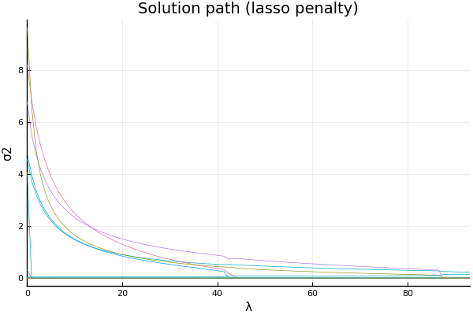
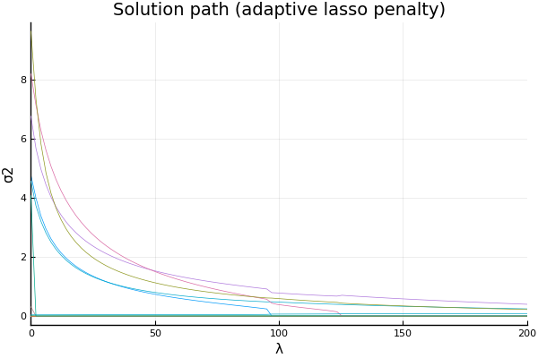
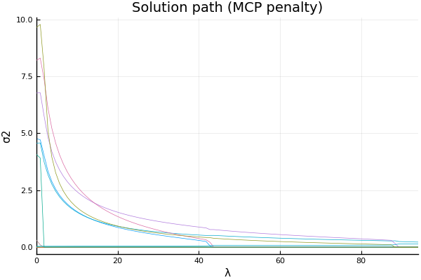
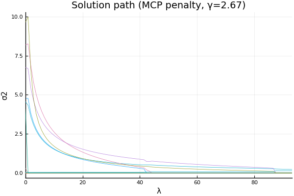

## Variance component selection for a univariate response model
### : simulation using R `SKAT.haplotypes` data

The package `VarianceComponentSelect` has not yet been registered and must be installed using the repository location. Start julia and use the `]` key to switch to the package manager REPL:
```julia
(v0.7) pkg> add https://github.com/juhkim111/VarianceComponentSelect.jl.git
```
Use the backspace key to return to the Julia REPL.


```julia
using VarianceComponentSelect
```

We use haplotype data ([`SKAT.haplotypes`](https://cran.r-project.org/web/packages/SKAT/SKAT.pdf#page=23)) in R [`SKAT`](https://cran.r-project.org/web/packages/SKAT/SKAT.pdf) package to generate genotype matrix. This dataset is generated by calibration coalescent model (COSI) with mimicking LD structure of European ancestry.
Load `RCall` package, which allows us to call R packages from within Julia.


```julia
using RCall
```


```julia
R"""
    packages <- c("SKAT", "gglasso")
    if (length(setdiff(packages, rownames(installed.packages()))) > 0) {
    install.packages(setdiff(packages, rownames(installed.packages())))
    }
    library(SKAT)
    data("SKAT.haplotypes")
    Haplotype <- SKAT.haplotypes$Haplotype
    SNPInfo <- SKAT.haplotypes$SNPInfo
""";
```

`SKAT.haplotypes` consists of two objects: `Haplotype` matrix and `SNPInfo` dataframe.
`Haplotype` is a matrix of size $10,000\times 3845$ where each row represents a different haplotype and each column represents a different SNP marker. 


```julia
@rget Haplotype
```


    10000×3845 Array{Int64,2}:
     0  0  0  0  0  0  0  0  0  0  0  0  0  …  0  0  0  0  0  0  0  0  0  0  0  0
     0  0  0  0  0  0  0  0  0  0  0  0  0     0  0  0  0  0  0  1  0  0  0  0  0
     0  0  0  0  0  1  0  0  0  0  0  0  0     0  0  0  0  0  0  1  0  0  0  0  0
     0  0  0  0  0  0  1  0  0  0  0  0  0     0  0  0  0  0  0  0  0  0  0  0  0
     0  0  0  0  0  0  0  0  0  0  0  0  0     0  0  0  0  0  0  0  0  0  0  0  0
     0  0  0  0  0  0  0  0  0  0  0  0  0  …  0  0  0  0  0  0  0  0  0  0  0  0
     0  0  0  0  0  0  1  0  0  0  0  0  0     0  0  0  0  0  0  0  0  0  0  0  0
     0  0  0  0  0  1  0  0  0  0  0  0  0     0  0  0  0  1  0  1  0  0  0  0  0
     0  0  0  0  0  0  0  0  0  0  0  0  0     0  0  0  0  0  0  0  0  0  0  0  0
     0  0  0  0  0  0  0  0  0  0  0  0  0     0  0  0  0  0  0  0  0  0  0  0  0
     0  0  0  0  0  0  1  0  0  0  0  0  0  …  0  0  0  0  0  0  0  0  0  0  0  0
     0  0  0  0  0  0  0  0  0  0  0  0  0     0  0  0  0  0  0  0  0  0  0  0  0
     0  0  0  0  0  0  0  0  0  0  0  0  0     0  0  0  0  0  0  0  0  0  0  0  0
     ⋮              ⋮              ⋮        ⋱        ⋮              ⋮            
     0  0  0  0  0  1  0  0  0  0  0  0  0     0  0  0  0  0  0  0  0  0  0  0  0
     0  0  0  0  0  0  0  0  0  0  0  0  0     0  0  0  0  0  0  0  0  0  0  0  0
     0  0  0  0  0  0  0  0  0  0  0  0  0  …  0  0  0  0  0  0  0  0  0  0  0  0
     0  0  0  0  0  0  0  0  0  0  0  0  0     0  0  0  0  0  0  1  0  0  0  0  0
     0  0  0  0  0  0  0  0  0  0  0  0  0     0  0  0  0  0  0  1  0  0  0  0  0
     0  0  0  0  0  1  0  0  0  0  0  0  0     0  0  0  0  0  0  1  0  0  0  0  0
     0  0  0  0  0  0  0  0  0  0  0  0  0     0  0  0  0  0  0  1  1  0  0  0  0
     0  0  0  0  0  0  0  0  0  0  0  0  0  …  0  0  0  0  0  0  0  0  0  0  0  0
     0  0  0  0  0  0  0  0  0  0  0  0  0     0  0  0  0  0  0  0  0  0  0  0  0
     0  0  0  0  0  0  1  0  0  0  0  0  0     0  0  0  0  0  0  0  0  0  0  0  0
     0  0  0  0  0  0  0  0  0  0  0  0  0     0  0  0  0  0  0  1  0  0  0  0  0
     0  0  0  0  0  0  0  0  0  0  0  0  0     0  0  0  0  0  0  1  0  0  0  0  0


`SNPInfo` contains information about 3845 SNPs in `Haplotype` matrix. All SNPs come from chromosome 1, and chromosome position ranges from 79 to 199956, or over 200k base pair region. 


```julia
@rget SNPInfo
```


<table class="data-frame"><thead><tr><th></th><th>SNP</th><th>CHROM</th><th>CHROM_POS</th><th>ALLELE1</th><th>FREQ1</th><th>ALLELE2</th><th>FREQ2</th></tr><tr><th></th><th>Int64</th><th>Int64</th><th>Int64</th><th>Int64</th><th>Float64</th><th>Int64</th><th>Float64</th></tr></thead><tbody><p>3,845 rows × 7 columns</p><tr><th>1</th><td>1</td><td>1</td><td>79</td><td>1</td><td>0.0008</td><td>2</td><td>0.9992</td></tr><tr><th>2</th><td>2</td><td>1</td><td>281</td><td>1</td><td>0.0001</td><td>2</td><td>0.9999</td></tr><tr><th>3</th><td>3</td><td>1</td><td>344</td><td>1</td><td>0.0001</td><td>2</td><td>0.9999</td></tr><tr><th>4</th><td>4</td><td>1</td><td>385</td><td>1</td><td>0.001</td><td>2</td><td>0.999</td></tr><tr><th>5</th><td>5</td><td>1</td><td>403</td><td>1</td><td>0.0011</td><td>2</td><td>0.9989</td></tr><tr><th>6</th><td>6</td><td>1</td><td>428</td><td>1</td><td>0.1387</td><td>2</td><td>0.8613</td></tr><tr><th>7</th><td>7</td><td>1</td><td>501</td><td>1</td><td>0.1051</td><td>2</td><td>0.8949</td></tr><tr><th>8</th><td>8</td><td>1</td><td>536</td><td>1</td><td>0.0011</td><td>2</td><td>0.9989</td></tr><tr><th>9</th><td>9</td><td>1</td><td>607</td><td>1</td><td>0.0015</td><td>2</td><td>0.9985</td></tr><tr><th>10</th><td>10</td><td>1</td><td>612</td><td>1</td><td>0.0002</td><td>2</td><td>0.9998</td></tr><tr><th>11</th><td>11</td><td>1</td><td>739</td><td>1</td><td>0.0008</td><td>2</td><td>0.9992</td></tr><tr><th>12</th><td>12</td><td>1</td><td>808</td><td>1</td><td>0.0003</td><td>2</td><td>0.9997</td></tr><tr><th>13</th><td>13</td><td>1</td><td>819</td><td>1</td><td>0.0002</td><td>2</td><td>0.9998</td></tr><tr><th>14</th><td>14</td><td>1</td><td>831</td><td>1</td><td>0.0002</td><td>2</td><td>0.9998</td></tr><tr><th>15</th><td>15</td><td>1</td><td>965</td><td>1</td><td>0.0068</td><td>2</td><td>0.9932</td></tr><tr><th>16</th><td>16</td><td>1</td><td>990</td><td>1</td><td>0.0001</td><td>2</td><td>0.9999</td></tr><tr><th>17</th><td>17</td><td>1</td><td>1190</td><td>1</td><td>0.0001</td><td>2</td><td>0.9999</td></tr><tr><th>18</th><td>18</td><td>1</td><td>1245</td><td>1</td><td>0.1688</td><td>2</td><td>0.8312</td></tr><tr><th>19</th><td>19</td><td>1</td><td>1279</td><td>1</td><td>0.0001</td><td>2</td><td>0.9999</td></tr><tr><th>20</th><td>20</td><td>1</td><td>1584</td><td>1</td><td>0.0003</td><td>2</td><td>0.9997</td></tr><tr><th>21</th><td>21</td><td>1</td><td>1722</td><td>1</td><td>0.0189</td><td>2</td><td>0.9811</td></tr><tr><th>22</th><td>22</td><td>1</td><td>1723</td><td>1</td><td>0.0003</td><td>2</td><td>0.9997</td></tr><tr><th>23</th><td>23</td><td>1</td><td>1761</td><td>1</td><td>0.006</td><td>2</td><td>0.994</td></tr><tr><th>24</th><td>24</td><td>1</td><td>1830</td><td>1</td><td>0.0826</td><td>2</td><td>0.9174</td></tr><tr><th>25</th><td>25</td><td>1</td><td>1855</td><td>1</td><td>0.1116</td><td>2</td><td>0.8884</td></tr><tr><th>26</th><td>26</td><td>1</td><td>1886</td><td>1</td><td>0.0005</td><td>2</td><td>0.9995</td></tr><tr><th>27</th><td>27</td><td>1</td><td>1985</td><td>1</td><td>0.0004</td><td>2</td><td>0.9996</td></tr><tr><th>28</th><td>28</td><td>1</td><td>2020</td><td>1</td><td>0.0005</td><td>2</td><td>0.9995</td></tr><tr><th>29</th><td>29</td><td>1</td><td>2042</td><td>1</td><td>0.0197</td><td>2</td><td>0.9803</td></tr><tr><th>30</th><td>30</td><td>1</td><td>2083</td><td>1</td><td>0.1045</td><td>2</td><td>0.8955</td></tr><tr><th>&vellip;</th><td>&vellip;</td><td>&vellip;</td><td>&vellip;</td><td>&vellip;</td><td>&vellip;</td><td>&vellip;</td><td>&vellip;</td></tr></tbody></table>


Assume one gene to be 5kb long, which translates to having 40 genes. We also assume sample size to be 500.


```julia
m = 40 # no. of genes
pj = 5000 # gene size 
n = 500 # sample size
```


    500


Suppose that there are 5 causal genes, and that they are evenly spread across all 40 genes/groups. 


```julia
σ2 = zeros(m + 1)
σ2[end] = 1.0
for iter in Int.(round.(range(1, stop=m, length=5)))
     σ2[iter] = 5.0
end
```

These genes have positive variance components:


```julia
Int.(round.(range(1, stop=m, length=5)))
```


    5-element Array{Int64,1}:
      1
     11
     20
     30
     40


Set seed first. 


```julia
using Random
Random.seed!(123);
```

To create a genotype matrix whose entries consist of {0,1,2}, we select `2n` rows from `Haplotype` without replacement and add the first `n` rows to the last `n` rows.


```julia
using StatsBase, LinearAlgebra
n = 500 # sample sizE 
idx = zeros(Int64, 2n)
sample!(1:size(Haplotype, 1), idx; replace=false)

# add two haplotype matrices to create a big block of genotype matrix
G = Haplotype[idx[1:n], :] + Haplotype[idx[n + 1:end], :]
```


    500×3845 Array{Int64,2}:
     0  0  0  0  0  0  0  0  0  0  0  0  0  …  0  0  0  0  0  0  0  0  0  0  0  0
     0  0  0  1  0  1  0  0  0  0  0  0  0     0  0  0  0  0  0  0  0  0  0  0  0
     0  0  0  0  0  1  0  0  0  0  0  0  0     0  0  0  0  0  0  0  0  0  0  0  0
     0  0  0  0  0  0  1  0  0  0  0  0  0     0  0  0  0  0  0  0  0  0  0  0  0
     0  0  0  0  0  0  0  0  0  0  0  0  0     0  0  0  0  0  0  0  0  0  0  0  0
     0  0  0  0  0  0  0  0  0  0  0  0  0  …  0  0  0  0  0  0  1  0  0  0  0  0
     0  0  0  0  0  0  1  0  0  0  0  0  0     0  0  0  0  0  0  2  0  0  0  0  0
     0  0  0  0  0  0  0  0  0  0  0  0  0     0  0  0  0  0  0  2  0  0  0  0  0
     0  0  0  0  0  0  0  0  0  0  0  0  0     0  0  0  0  0  0  0  0  0  0  0  0
     0  0  0  0  0  0  0  0  0  0  0  0  0     0  0  0  0  0  0  0  0  0  0  0  0
     0  0  0  0  0  1  0  0  0  0  0  0  0  …  0  0  0  0  0  0  2  0  0  0  0  0
     0  0  0  0  0  0  0  0  0  0  0  0  0     0  0  0  0  0  0  0  0  0  0  0  0
     0  0  0  0  0  0  0  0  0  0  0  0  0     0  0  0  0  0  0  0  0  0  0  0  0
     ⋮              ⋮              ⋮        ⋱        ⋮              ⋮            
     0  0  0  0  0  1  0  0  0  0  0  0  0     0  0  0  0  0  0  0  0  0  0  0  0
     0  0  0  0  0  0  0  0  0  0  0  0  0     0  0  0  0  0  0  1  0  0  0  0  0
     0  0  0  0  0  0  1  0  0  0  0  0  0  …  0  0  0  0  0  0  1  0  0  0  0  0
     0  0  0  0  0  0  0  0  0  0  0  0  0     0  0  0  0  0  0  0  0  0  0  0  0
     0  0  0  0  0  0  0  0  0  0  0  0  0     0  0  0  0  0  0  1  0  0  0  0  0
     0  0  0  0  0  1  0  0  0  0  0  0  0     0  0  0  0  0  0  1  0  0  0  0  0
     0  0  0  0  0  0  0  0  0  0  0  0  0     0  0  0  0  0  0  0  0  0  0  0  0
     0  0  0  0  0  0  1  0  0  0  0  0  0  …  0  0  0  0  0  0  0  0  0  0  0  0
     0  0  0  1  0  0  0  0  0  0  0  0  0     0  0  0  0  0  0  1  0  0  0  0  0
     0  0  0  0  0  1  0  0  0  0  0  0  0     0  0  0  0  0  0  0  0  0  0  0  0
     0  0  0  0  0  1  0  0  0  0  0  0  0     0  0  0  0  0  0  1  0  0  0  0  0
     0  0  0  0  0  0  1  0  0  0  0  0  0     0  0  0  0  0  0  0  0  0  0  0  0


Now we construct covariance matrices `V[i]` for each `i`-th gene by dividing up `G` matrix by chromosome position (5000kb), multiplying by its transpose, and dividing by its Frobenius norm. 
Ultimately, we add these covariance matrices multiplied by variance component to create the overall covariance matrix `Ω`.


```julia
## construct covariance matrix Ω
Ω  = zeros(n, n)
grp_id = zeros(Int64, size(Haplotype, 2))
V  = Array{Matrix{Float64}}(undef, m + 1)
for k in 1:m
    local k
    i = k
    grp_id[(SNPInfo.CHROM_POS .> pj * (i-1)) .& (SNPInfo.CHROM_POS .<= pj * i)] .= i
    Vi = view(G, :, grp_id .== i)
    V[i] = Vi * Vi'
    V[i] ./= norm(V[i])
    Ω .+= σ2[i] .* V[i]
end
V[m + 1] = Matrix{Float64}(I, n, n) / √n
Ω .+= σ2[m + 1] .* V[m + 1]
Ωchol = cholesky(Hermitian(Ω)) # cholesky factorization after making it symmetric 
```


    Cholesky{Float64,Array{Float64,2}}
    U factor:
    500×500 UpperTriangular{Float64,Array{Float64,2}}:
     0.286665  0.0308989  0.0         0.0929487   …   0.0           0.0189187  
      ⋅        0.314658   0.0736505   0.0190226       0.101801      0.0264071  
      ⋅         ⋅         0.31854    -0.00439827      0.104943      0.0218148  
      ⋅         ⋅          ⋅          0.351454        0.0575279     0.0555649  
      ⋅         ⋅          ⋅           ⋅              0.0366417     0.0350243  
      ⋅         ⋅          ⋅           ⋅          …   0.0636818     0.0445843  
      ⋅         ⋅          ⋅           ⋅              0.0735116     0.0241263  
      ⋅         ⋅          ⋅           ⋅              0.0334636    -0.0561523  
      ⋅         ⋅          ⋅           ⋅             -0.0718995     0.118174   
      ⋅         ⋅          ⋅           ⋅              0.0737071    -0.00769136 
      ⋅         ⋅          ⋅           ⋅          …   0.00933045    0.00570924 
      ⋅         ⋅          ⋅           ⋅             -0.014867      0.012746   
      ⋅         ⋅          ⋅           ⋅              0.0403189    -0.00854823 
     ⋮                                            ⋱                            
      ⋅         ⋅          ⋅           ⋅              0.0045296    -0.00181669 
      ⋅         ⋅          ⋅           ⋅             -0.00123152    0.00259173 
      ⋅         ⋅          ⋅           ⋅          …   0.000440328   0.0016991  
      ⋅         ⋅          ⋅           ⋅              0.000947484   0.000529841
      ⋅         ⋅          ⋅           ⋅             -0.00127865   -0.000652502
      ⋅         ⋅          ⋅           ⋅             -0.00173592    0.00325268 
      ⋅         ⋅          ⋅           ⋅             -0.00100727   -0.000420654
      ⋅         ⋅          ⋅           ⋅          …  -0.00138927    0.00551104 
      ⋅         ⋅          ⋅           ⋅             -0.000589728  -0.000973307
      ⋅         ⋅          ⋅           ⋅              0.0028112    -0.000481491
      ⋅         ⋅          ⋅           ⋅              0.22908      -0.00141437 
      ⋅         ⋅          ⋅           ⋅               ⋅            0.217768   


Finally, we create a response vector using the Cholesky factorization.


```julia
y = Ωchol.L * randn(n)
```


    500-element Array{Float64,1}:
      0.059889941943584386
      0.06824553481637262 
     -0.29290706471620015 
      0.08978502507920363 
      0.6397891195270545  
     -0.014517537765035669
     -1.6023858737232344  
     -0.7841014472220409  
     -1.1041977245535062  
     -0.20279368671486095 
      0.8365223133572526  
      0.37968925223209127 
     -0.20229457721826052 
      ⋮                   
      0.21925045485687303 
      0.08737564271358689 
     -0.18967924309033846 
     -0.43192159964878957 
      0.30631547857769326 
     -0.8258313372086057  
     -0.11582926210791059 
      0.2672375561735326  
      0.2615727818393714  
      0.1694015518084827  
     -0.4081986034117404  
     -0.680984950494975   


We also generate a covariate matrix with 3 covariates. 


```julia
p = 10
X = randn(n, p)
```


    500×10 Array{Float64,2}:
     -0.357512  -1.20512    0.456071   …   0.469279   -0.4246      -0.180256 
      1.10493    0.510995   1.78939        1.05211     0.190831    -1.54762  
      0.360943  -0.797932   2.36725       -0.607956    0.0199318   -0.327498 
      1.07779    1.01809   -1.301          0.775929   -0.412176     1.16717  
      0.211548   0.887211   2.27531       -2.34106     0.0259707   -2.4649   
     -2.1254    -1.2528    -2.61588    …   0.47917     0.170861    -0.90011  
      1.04942    1.20896    0.0358361     -0.458283   -0.667652     2.04367  
     -0.354441   0.197945  -1.02732        0.313368   -0.358023     1.02745  
     -0.160404  -0.613613  -0.304309       1.7622     -1.33322     -0.571754 
     -0.60608    0.557166   0.0483144     -1.65057     0.969906    -0.123887 
      0.43255    0.968414  -0.755504   …   1.7669      0.172893     1.88857  
     -1.24071   -0.819892   0.665363       1.17051     0.531119    -0.867992 
     -0.528542  -1.16037    1.43009       -0.416337   -0.168258    -0.886616 
      ⋮                                ⋱                                     
     -1.67615   -0.472136   2.35662        0.860705   -0.606173     0.834554 
      0.212162   1.03849    0.686549      -0.995205   -1.43156     -1.11033  
     -0.661038   0.424151   0.459902   …  -3.23621    -0.29664     -0.170786 
      0.371671  -0.599162  -0.817982       1.18965     0.00425142   0.841974 
      0.119844  -0.105837   1.14339        0.446714   -0.208301    -2.43333  
     -0.676135   0.35366    0.580982      -0.0896436   1.2424      -0.952072 
     -0.662983  -0.884039   0.343579      -0.443486   -1.25671     -0.454056 
      0.54363   -1.028      0.281233   …  -0.0296757  -0.312401    -0.720047 
     -1.48729    0.644132  -0.55533       -0.871628    1.15615      1.0172   
     -0.61825   -0.102662  -0.940408       0.726759    1.28837      1.38323  
      1.80971    0.650056   0.716876       0.0736413  -2.07289      0.510645 
     -0.699842  -0.69557    0.721458      -1.51068     1.60719     -0.0768434


Finally, we are ready to perform variance component selection. 


```julia
using PenaltyFunctions
```

First, let's estimate `σ2` using no penalty.


```julia
σ2, obj, = vcselect(y, X, V)
```


    ([4.76263, 6.89537e-17, 3.94118e-36, 2.79432e-19, 4.30498e-53, 2.24497e-20, 8.19718e-63, 6.31832e-16, 7.90088e-25, 4.39373e-9  …  1.34213e-53, 0.00622915, 2.3417e-30, 1.80061e-16, 4.93655e-25, 3.85262e-22, 5.24315e-11, 4.07437, 9.637, 0.0391046], -16.24333205061083, 144, [0.165234 0.0544481 … 0.0310792 0.112705; 0.0544481 0.167105 … 0.0153651 0.0151028; … ; 0.0310792 0.0153651 … 0.202942 -0.0132805; 0.112705 0.0151028 … -0.0132805 0.325005], [23.5239 -1.07158 … -0.122228 -0.520898; -1.07158 18.993 … 0.0788421 -0.127254; … ; -0.122228 0.0788421 … 20.9875 -0.197015; -0.520898 -0.127254 … -0.197015 20.2557])


```julia
maximum(σ2)
```


    9.637003152115575


We can use the estimates above as a penalty weight for adaptive lasso penalty. 


```julia
penwt = zeros(m + 1)
penwt[1:m] = 1 ./ sqrt.(σ2[1:m])
```


    40-element Array{Float64,1}:
          0.4582225003356609   
          1.2042624893842031e8 
          5.037172404194073e17 
          1.89174199222047e9   
          1.524103362627934e26 
          6.674127529742688e9  
          1.104505097094322e31 
          3.978316003854715e7  
          1.1250254032297588e12
      15086.311703429588       
          0.4680106329623046   
          3.5440127538079424e21
          3.502127352276433e9  
          ⋮                    
        122.09181040472501     
          0.34932016248734765  
          8.187365308305049e10 
          2.7296282321200786e26
         12.670258313530718    
          6.534828288331194e14 
          7.452301013392845e7  
          1.4232733370625708e12
          5.094741516953133e10 
     138103.29354726535        
          0.49541565884604527  
          0.3221283881390994   


Here we obtain solution path using three different penalties: lasso (`L1Penalty()`), adaptive lasso, and MCP penalty (`MCPPenalty()`). For MCP penalty, default `γ` value equals to 2.0.


```julia
σ2path_lasso, objpath_lasso, λpath_lasso = vcselectPath(y, X, V; penfun=L1Penalty())
```


    ([4.76263 4.71122 … 0.0 0.0; 6.89537e-17 0.0 … 0.0 0.0; … ; 9.637 9.77542 … 0.0 0.0; 0.0391046 0.0392404 … 0.0971057 0.0972453], [-16.2433, -10.1653, -4.54223, 1.15906, 6.8603, 8.49131, 13.243, 17.9947, 22.7465, 28.9062  …  286.866, 288.28, 289.691, 291.098, 292.502, 293.903, 295.302, 296.697, 298.089, 299.479], 0.0:0.9503422571628649:94.08388345912363)


```julia
σ2path_adlasso, objpath_adlasso, λpath_adlasso = vcselectPath(y, X, V; penfun=L1Penalty(), penwt=penwt)
```


    ([4.76263 3.9934 … 0.0 0.0; 6.89537e-17 0.0 … 0.0 0.0; … ; 9.637 7.34859 … 0.224618 0.220574; 0.0391046 0.0405187 … 0.0850204 0.0853353], [-16.2433, -5.61942, 3.2002, 11.3943, 19.0917, 26.3806, 33.3245, 39.9712, 46.3578, 52.5136  …  273.002, 274.349, 275.686, 277.013, 278.33, 279.638, 280.937, 282.225, 283.504, 284.774], 0.0:2.0234638624644923:200.32292238398472)


```julia
σ2path_mcp, objpath_mcp, λpath_mcp = vcselectPath(y, X, V; penfun=MCPPenalty())
```


    ([4.76263 4.7112 … 0.0 0.0; 6.89537e-17 0.0 … 0.0 0.0; … ; 9.637 9.77551 … 0.0 0.0; 0.0391046 0.0392405 … 0.139217 0.139501], [-16.2433, -10.1653, -5.40545, 0.811947, 7.36727, 13.9743, 20.5094, 26.9356, 33.2243, 39.3753  …  278.916, 280.462, 282.009, 281.601, 272.493, 273.014, 273.532, 274.046, 274.557, 275.065], 0.0:0.9503422571628649:94.08388345912363)


We plot the solution path below.


```julia
using Plots; pyplot();
```

    ┌ Info: Precompiling Plots [91a5bcdd-55d7-5caf-9e0b-520d859cae80]
    └ @ Base loading.jl:1186
    ┌ Warning: Module Reexport with build ID 60288655607376 is missing from the cache.
    │ This may mean Reexport [189a3867-3050-52da-a836-e630ba90ab69] does not support precompilation but is imported by a module that does.
    └ @ Base loading.jl:941
    ┌ Info: Precompiling StaticArrays [90137ffa-7385-5640-81b9-e52037218182]
    └ @ Base loading.jl:1186
    ┌ Info: Precompiling PlotUtils [995b91a9-d308-5afd-9ec6-746e21dbc043]
    └ @ Base loading.jl:1186
    ┌ Warning: Module Reexport with build ID 60288655607376 is missing from the cache.
    │ This may mean Reexport [189a3867-3050-52da-a836-e630ba90ab69] does not support precompilation but is imported by a module that does.
    └ @ Base loading.jl:941
    ┌ Info: Precompiling Colors [5ae59095-9a9b-59fe-a467-6f913c188581]
    └ @ Base loading.jl:1186
    ┌ Warning: Module Reexport with build ID 60288655607376 is missing from the cache.
    │ This may mean Reexport [189a3867-3050-52da-a836-e630ba90ab69] does not support precompilation but is imported by a module that does.
    └ @ Base loading.jl:941
    ┌ Info: Precompiling ColorTypes [3da002f7-5984-5a60-b8a6-cbb66c0b333f]
    └ @ Base loading.jl:1186
    ┌ Info: Precompiling PlotThemes [ccf2f8ad-2431-5c83-bf29-c5338b663b6a]
    └ @ Base loading.jl:1186
    ┌ Warning: Module PlotUtils with build ID 149643334242886 is missing from the cache.
    │ This may mean PlotUtils [995b91a9-d308-5afd-9ec6-746e21dbc043] does not support precompilation but is imported by a module that does.
    └ @ Base loading.jl:941
    ┌ Info: Precompiling Showoff [992d4aef-0814-514b-bc4d-f2e9a6c4116f]
    └ @ Base loading.jl:1186
    ┌ Warning: Module Compat with build ID 107193014201973 is missing from the cache.
    │ This may mean Compat [34da2185-b29b-5c13-b0c7-acf172513d20] does not support precompilation but is imported by a module that does.
    └ @ Base loading.jl:941
    ┌ Info: Precompiling NaNMath [77ba4419-2d1f-58cd-9bb1-8ffee604a2e3]
    └ @ Base loading.jl:1186
    ┌ Warning: Module Compat with build ID 107193014201973 is missing from the cache.
    │ This may mean Compat [34da2185-b29b-5c13-b0c7-acf172513d20] does not support precompilation but is imported by a module that does.
    └ @ Base loading.jl:941
    ┌ Info: Precompiling Measures [442fdcdd-2543-5da2-b0f3-8c86c306513e]
    └ @ Base loading.jl:1186
    ┌ Info: Precompiling GR [28b8d3ca-fb5f-59d9-8090-bfdbd6d07a71]
    └ @ Base loading.jl:1186
    ┌ Info: Precompiling PyPlot [d330b81b-6aea-500a-939a-2ce795aea3ee]
    └ @ Base loading.jl:1186
    ┌ Warning: Module VersionParsing with build ID 107195228272017 is missing from the cache.
    │ This may mean VersionParsing [81def892-9a0e-5fdd-b105-ffc91e053289] does not support precompilation but is imported by a module that does.
    └ @ Base loading.jl:941
    ┌ Warning: Module VersionParsing with build ID 107195228272017 is missing from the cache.
    │ This may mean VersionParsing [81def892-9a0e-5fdd-b105-ffc91e053289] does not support precompilation but is imported by a module that does.
    └ @ Base loading.jl:941
    ┌ Info: Precompiling PyCall [438e738f-606a-5dbb-bf0a-cddfbfd45ab0]
    └ @ Base loading.jl:1186
    ┌ Warning: Module VersionParsing with build ID 107195228272017 is missing from the cache.
    │ This may mean VersionParsing [81def892-9a0e-5fdd-b105-ffc91e053289] does not support precompilation but is imported by a module that does.
    └ @ Base loading.jl:941
    ┌ Info: Precompiling MacroTools [1914dd2f-81c6-5fcd-8719-6d5c9610ff09]
    └ @ Base loading.jl:1186
    ┌ Warning: Module DataStructures with build ID 97213185151035 is missing from the cache.
    │ This may mean DataStructures [864edb3b-99cc-5e75-8d2d-829cb0a9cfe8] does not support precompilation but is imported by a module that does.
    └ @ Base loading.jl:941
    ┌ Info: Precompiling CSTParser [00ebfdb7-1f24-5e51-bd34-a7502290713f]
    └ @ Base loading.jl:1186
    ┌ Info: Precompiling LaTeXStrings [b964fa9f-0449-5b57-a5c2-d3ea65f4040f]
    └ @ Base loading.jl:1186
    ┌ Warning: Module Compat with build ID 107193014201973 is missing from the cache.
    │ This may mean Compat [34da2185-b29b-5c13-b0c7-acf172513d20] does not support precompilation but is imported by a module that does.
    └ @ Base loading.jl:941


```julia
plot(λpath_lasso, σ2path_lasso', label="", xaxis=("λ", (minimum(λpath_lasso), maximum(λpath_lasso))), 
    yaxis=("σ2"), width=0.5)
title!("Solution path (lasso penalty)")
```





```julia
plot(λpath_adlasso, σ2path_adlasso', label="", xaxis=("λ", (minimum(λpath_adlasso), maximum(λpath_adlasso))), 
    yaxis=("σ2"), width=0.5)
title!("Solution path (adaptive lasso penalty)")
```





```julia
plot(λpath_mcp, σ2path_mcp', label="", xaxis=("λ", (minimum(λpath_mcp), maximum(λpath_mcp))), 
    yaxis=("σ2"), width=0.5)
title!("Solution path (MCP penalty)")
```





For MCP penalty, we used the default value `γ=2.0`. Instead, let's try `γ=2.67`, and plot the solution path. 


```julia
σ2path_mcp, objpath_mcp, λpath_mcp = vcselectPath(y, X, V; penfun=MCPPenalty(2.67))
```


    ([4.76263 4.77248 … 0.0 0.0; 6.89537e-17 0.0 … 0.0 0.0; … ; 9.637 9.97102 … 0.0 0.0; 0.0391046 0.0400773 … 0.138986 0.139262], [-16.2433, -9.08125, -2.40379, 4.77747, 11.9122, 18.8989, 25.7097, 32.3403, 38.7956, 45.0837  …  281.522, 283.011, 284.493, 272.926, 273.438, 273.945, 274.448, 274.947, 275.443, 275.934], 0.0:0.9416097376572679:93.21936402806952)


```julia
plot(λpath_mcp, σ2path_mcp', label="", xaxis=("λ", (minimum(λpath_mcp), maximum(λpath_mcp))), 
    yaxis=("σ2"), width=0.5)
title!("Solution path (MCP penalty, γ=2.67)")
```





